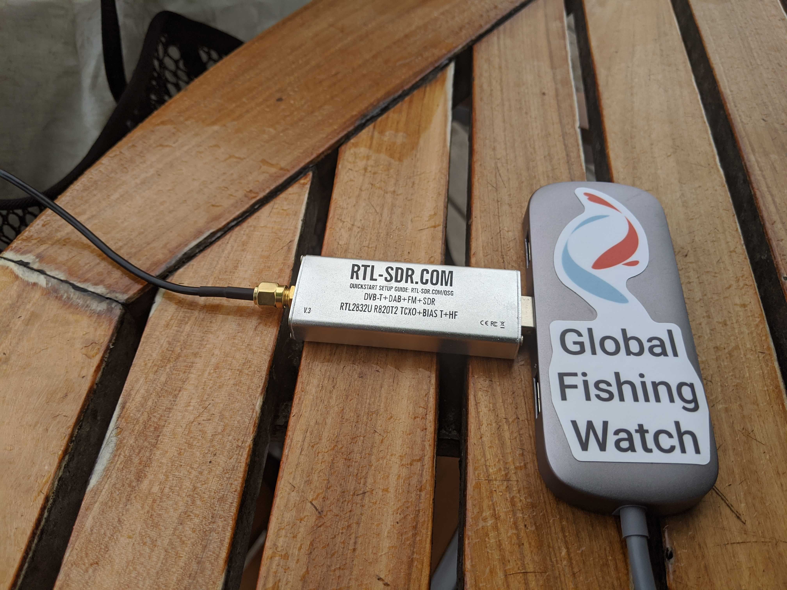
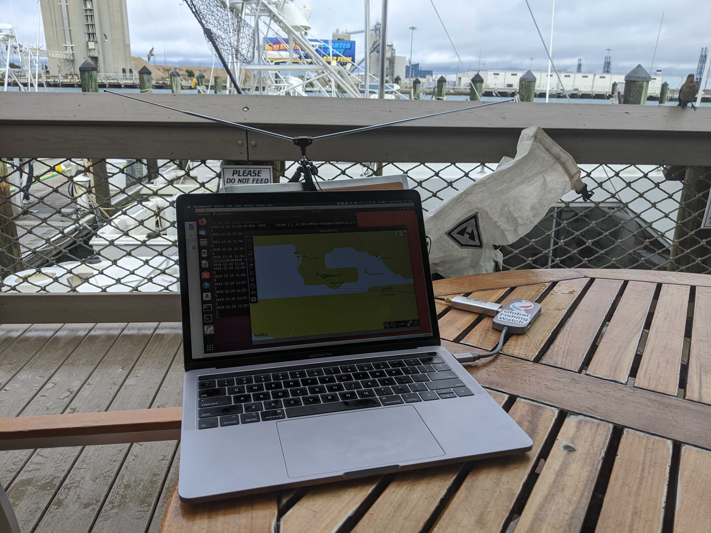
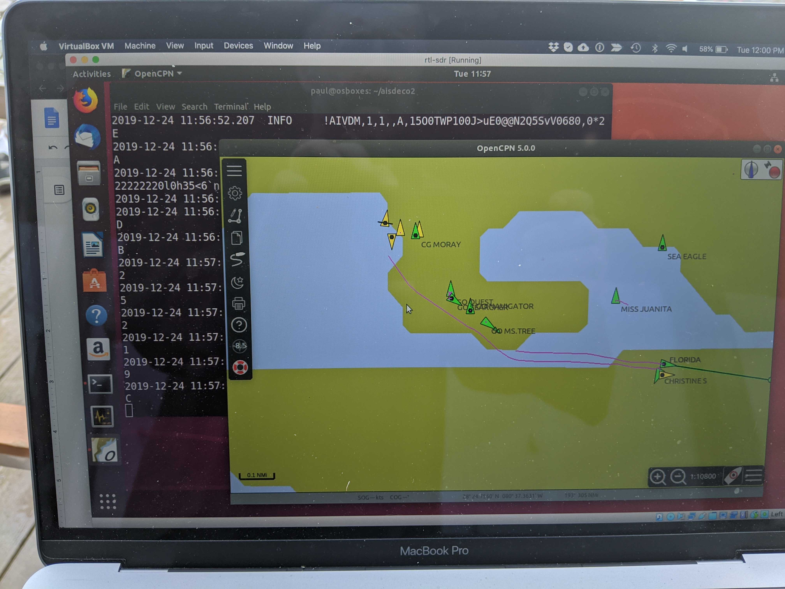

#AIS Receiver

## Laptop-based Setup Dec 2019
* Macbook pro
* VirtualBox
* Ubuntu 18.04 running in VirtualBox
    * VM networking set to “bridged”

### Installed In Ubuntu    
    * [Aisdeco2](http://xdeco.org/?page_id=30#ai2)
    * [Open CPN](https://opencpn.org/index.html)

### Hardware     
    * RTL-SDR hardware (RTL2832U)
    * Antenna included with RTL-SDR kit

### Configuration
    * Connect the RTL2832U to the laptop
    * Connect the RTL2832U to the VM via the VirtualBox USB menu
    * Set the VirtualBox netoworking mode to Bridged
    * In OpenCPN, create a new input connection: UDP, localhost, port 4159
    * Optional - install high resolution chars in OpenCPPN
    
### Execution
* Startup OpenCPN
* in a terminal run 
```
./aisdeco2 --agc --freq-correction -1 --udp 192.168.43.250:4159
```
Where `192.168.43.25` is the local IP address.  Note that this does not work with `localhost` or `127.0.0.1`

`-freq-correction -1` is the correction factor for the individual SDR hardware.  This needs to be determined experimentally.

If there are AIS messages to be received, they will be logged to the console and also sent to the UDP port.  If everything is set up right then vessels will appear in OpenCPN


## Raspberry Pi Setup


### Hardware
* Raspberry Pi 4 Model B 4 GB Ram
* RTL-SDR hardware (RTL2832U)

 
### Install
Instructions for OSX
* Download the [SatNOGS Pi image](https://wiki.satnogs.org/Raspberry_Pi_3)
* Use [The Unarchiver](https://theunarchiver.com/) to unpack the image zip file
* Use [balenaEtcher](https://www.balena.io/etcher/) to create the Pi boot image on an sd card
* install the SD card and start up the Pi
* Helpful hint: to set up networking on the PI without a monitor and keyboard, use the pre-boot configuration to set up a wifi connection so you can start up headless and ssh in
See https://wiki.satnogs.org/Raspberry_Pi_3#Pre-boot_wireless_configuration
* Download the SatNOGS Raspian Pi image from here http://xdeco.org/?page_id=30#ai2

```buildoutcfg
scp ~/Downloads/aisdeco2_rpi2-3_deb9_20180430.tgz pi@raspberrypi.local:~
ssh pi@raspberrypi.local
mkdir aisdeco2
mv aisdeco2_rpi2-3_deb9_20180430.tgz aisdeco2
cd aisdeco2
tar xzf aisdeco2_rpi2-3_deb9_20180430.tgz 
./aisdeco2 --device-list
```

If the RTL-SDR device is found you should see

```buildoutcfg
2019-12-25 17:24:30.584  INFO     AiSDeco2 v.20180430
Available Devices:
 0: Generic RTL2832U OEM
```

### Testing at Port Canveral 

with aisdeco2 and OpenCPN running in Ubuntu on the MBP








### Operation
#### Running the ais receiver in a terminal
```buildoutcfg
ssh pi@rpiais.local
# test to make sure the RTL-SDR device is connected
aisdeco2/aisdeco2 --device-list
```

Should see 
```
2020-08-02 14:55:56.296  INFO     AiSDeco2 v.20180430
Available Devices:
 0: Generic RTL2832U OEM
```

Output AIS to stdout
```buildoutcfg
./aisdeco2 --udp 192.168.2.3:4123 --agc
```

other stuff

sudo systemctl start signalk.socket
 nc -i 1 -u 192.168.2.3 4123 < port-canaveral-2019-12-29.nmea

```