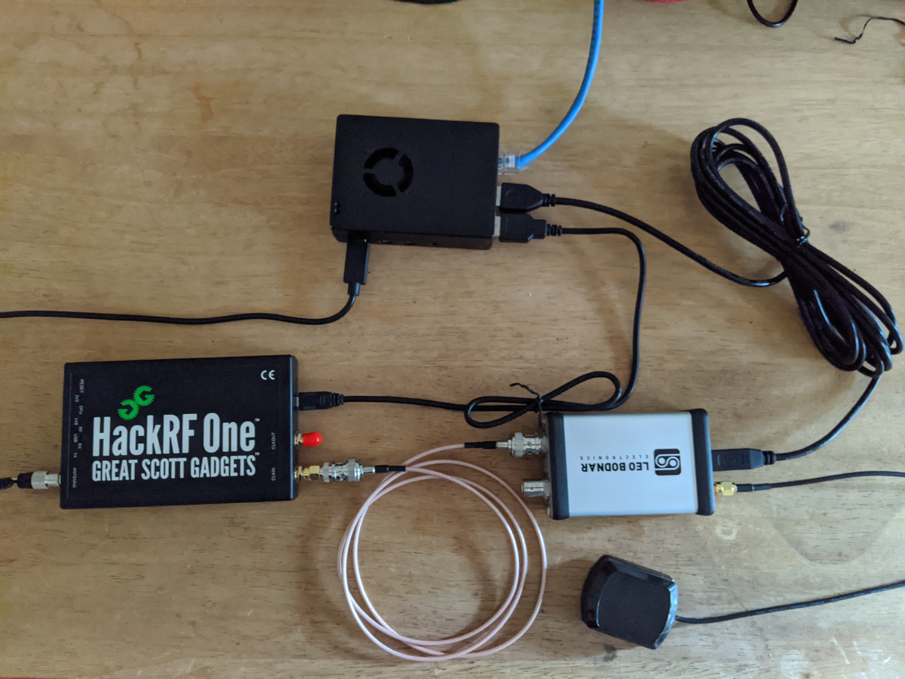

# First build - Raspberry Pi and HackerRF with Ubuntu 18.04 LTS

[Project Overview](../README.md)

- Goal: Get this working https://github.com/B44D3R/SDR-GPS-SPOOF
- Build date:  2020-08-05

## Installation

#### Hardware
- Raspberry Pi 4B
- [Hacker RF One](https://greatscottgadgets.com/hackrf_)
- [Ant500](https://greatscottgadgets.com/ant500)
- [GPS Clock](http://www.leobodnar.com/shop/index.php?main_page=product_info&cPath=107&products_id=234)



#### Set up the Raspberry Pi
- Download image for [64-bit Ubuntu 18.04 LTS for RPI 4](https://ubuntu.com/download/raspberry-pi)
- [Flash the image to SD Card](https://ubuntu.com/tutorials/create-an-ubuntu-image-for-a-raspberry-pi-on-macos#1-overview)

```sudo sh -c 'gunzip -c  ~/Downloads/ubuntu-18.04.4-preinstalled-server-arm64+raspi3.img.xz | sudo dd of=/dev/disk2 bs=32m'```
- Configure wifi https://ubuntu.com/tutorials/how-to-install-ubuntu-on-your-raspberry-pi#3-wifi-or-ethernet
```
# This didn't work for me so I just wired it in with ethernet
```
- Install the SD card and boot the RPI
- [Find the IP address](https://ubuntu.com/tutorials/how-to-install-ubuntu-on-your-raspberry-pi#4-boot-ubuntu-server)
```
$ arp -na | grep -i "dc:a6:32"
```
- SSH in to the RPI user: `ubuntu`  pwd:`ubuntu`

```ssh ubuntu@192.168.0.23```
Have to change the password the first time
 
- wait for the auto updates to finish running (can't run `apt install` until this is done)


#### Install some dependencies

On the RPI
```console
$ sudo apt-get update
$ sudo apt-get -y install \
                       git \
                       build-essential \
                       libusb-1.0-0-dev \
                       liblog4cpp5-dev \
                       libboost-dev \
                       libboost-system-dev \
                       libboost-thread-dev \
                       libboost-program-options-dev \
                       swig \
                       libfftw3-dev \
                       libusb-dev \
                       libusb-1.0-0-dev \
                       pkg-config \
                       cmake
```

#### Install HackRF
```console
mkdir ~/sdr
cd ~/sdr
git clone https://github.com/mossmann/hackrf.git
cd ~/sdr/hackrf/host
mkdir build
cd ~/sdr/hackrf/host/build
cmake ../ -DINSTALL_UDEV_RULES=ON
make
sudo make install
sudo ldconfig
```

### Test the HackrRF hardware
Connect the HackerRF One to the PI and do this
```
$ sudo hackrf_info
hackrf_info version: git-e93d70e
libhackrf version: git-e93d70e (0.5)
Found HackRF
Index: 0
Serial number: 000000000000000075b068dc32432307
Board ID Number: 2 (HackRF One)
Firmware Version: 2018.01.1 (API:1.02)
Part ID Number: 0xa000cb3c 0x0061435b
```

### Test the GPS Clock
Connect the GPS Clock to the HackRF and give it power.   Put the GPS antenna near a window and see that both LEDs are lit and steady.  Then do this to see that the HackRF is getting the 10MHz signal from the clock 

```
$ sudo hackrf_debug --si5351c -n 0 -r
```
Working
```
[  0] -> 0x01
```

Not working
```
[  0] -> 0x51
```

#### Install gnu-radio

```console
$ sudo apt-get install gnuradio \
                       gnuradio-dev \
                       gr-iqbal \
                       gqrx-sdr
$ volk_profile
```

#### Install gr-osmosdr

Installing v0.1.5 because the latest v0.2.0 requires a newer version of cmake which makes it incompatible with the version of gnu-radio that is installed with apt.   Rather than build gnu-radio, just roll back to the earlier version of gr-osmosdr
```console
cd ~/sdr
git clone https://github.com/osmocom/gr-osmosdr.git --branch v0.1.5
cd ~/sdr/gr-osmosdr
mkdir build
cd build
cmake ../
make
sudo make install
sudo ldconfig
```

#### Install gps-sdr-sim
```console
cd ~/sdr
git clone https://github.com/osqzss/gps-sdr-sim
cd gps-sdr-sim
gcc gpssim.c -lm -O3 -o gps-sdr-sim
```

Also add this to .bashrc for convenience
```console
export PATH="/home/ubuntu/sdr/gps-sdr-sim:$PATH"
```


## Operation

- Goal: cause a gps (android smart phone, Pixel 3) to set a false, fixed location

Make a working dir
```
cd ~/sdr
mkdir static-test
cd static-test
```

Download latest daily GPS broadcast ephemers file (brdc) via anonymous ftp. 
File format is `/gps/data/daily/YYYY/brdc/brdcDDD0.YYn.Z`
where 
- YYYY is the 4-digit year
- YY is the 2-digit year  
- DDD is the day of the year

for example Aug 5 2020 is day 218
```console
curl -u anonymous: \
    'ftp://cddis.gsfc.nasa.gov/gps/data/daily/2020/brdc/brdc2180.20n.Z' \
    --output - \
    | gunzip > brdc2180.20n
```

Generate a gps broadcast file for a static location.  Note that the timecode in the broadcast will begin 
at the start time of the brdc file which is 00:00:00 UTC 

37.925669,-122.732930 is Point Reyes, CA for example

default duration is 300 seconds

```console
gps-sdr-sim -b 8 -e brdc2180.20n -l 37.925669,-122.732930,100
```

Run the broadcast.  This will broadcast the spoofed gps signal. To get my phone to respond, I need to power it  on while the broadcast is running.  MIght also work if I start it up in airplane mode with location services turned off and then turn on location services while the broadcast is running


```console
sudo hackrf_transfer -t gpssim.bin -f 1575420000 -s 2600000 -a 1 -x 0
```